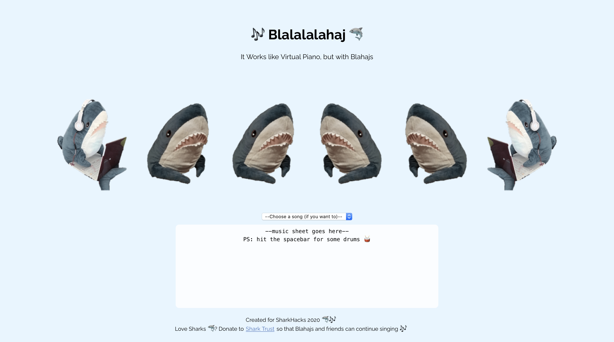

# Blalalalahaj

Blahaj loves to sing! The Blahaj choir team will be singing for you this christmas 🦈🎶

Try it out at: [https://blalalalahaj.co](blalalalahaj.co)

## Available Scripts

In the project directory, you can run:

### `yarn install`
Install the required stuff

### `yarn start`

Runs the app in the development mode.\
Open [http://localhost:3000](http://localhost:3000) to view it in the browser.

The page will reload if you make edits.\
You will also see any lint errors in the console.

### `yarn build`

Builds the app for production to the `build` folder.\
It correctly bundles React in production mode and optimizes the build for the best performance.

The build is minified and the filenames include the hashes.\
Your app is ready to be deployed!

See the section about [deployment](https://facebook.github.io/create-react-app/docs/deployment) for more information.

## Inspiration

I love playing [Virtual Piano](http://recursivearts.com/virtual-piano/), and had always wanted to create something similar. I also think that sharks are awesome singers (e.g. the viral baby shark). Thus, I have recruited 6 blahajs (4 vocalist, 2 percussionist, all from [this telegram sticker pack](https://tlgrm.eu/stickers/UPOROTAYAIKEA)) to perform for us during this festive season.

## What it does

It listens to keypresses and sings, following the virtual piano keymapping. So you can practice your typing skills with blalalalahaj!
This doesn't work on phones as you'll need to type on a keyboard!!

## How I built it

Using ReactJS and midi-sounds-react

## Challenges I ran into

Choosing the right voice for Blahaj

## Accomplishments that we're proud of

I'm genuinely proud of building something that is purely for fun. It might be a simple project but it rekindled my passion for web development. Also, I am proud that I'm able to build this in a short timeframe.

## What we learned

Hosting (I've never hosted anything without my friend's help, but I did it this time yay)

## What's next for Blalalalahaj

Include touch typing tutorials! "Learn how to type while watching Blahajes dance"
Also, I'll be making omatatatone, virtual kalimba and more fun stuff
